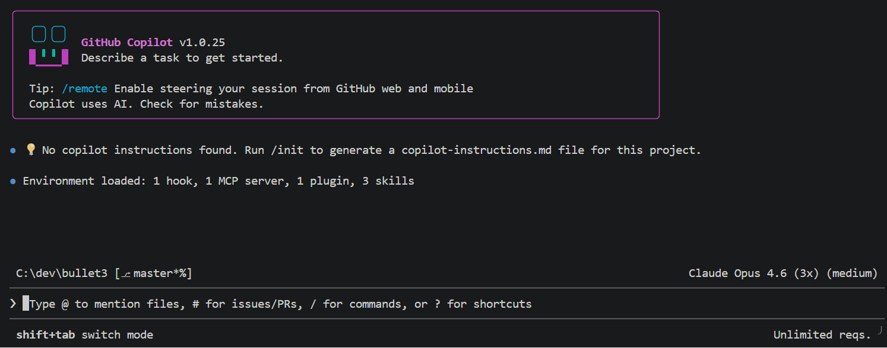

_The Microsoft C++ Language Server is currently in preview and may be subject to change in future releases._

**Microsoft C++ Language Server** brings the same C++ code intelligence used in Visual Studio and VS Code to GitHub Copilot CLI on Windows, macOS, and Linux. It provides fast, accurate understanding of C++ codebases with features like symbol search and semantic navigation.

# 🚀 Quick start

1. Run `npm install -g @microsoft/cpp-language-server`.
2. Run `mscppls --accept-eula --login` to accept the [license terms](https://www.npmjs.com/package/@microsoft/cpp-language-server?activeTab=code) and login to GitHub. An active GitHub Copilot subscription is required.
3. Create a [`compile_commands.json` file](https://clang.llvm.org/docs/JSONCompilationDatabase.html) for your project. For CMake projects, try [adding `-DCMAKE_EXPORT_COMPILE_COMMANDS=ON`](https://cmake.org/cmake/help/latest/variable/CMAKE_EXPORT_COMPILE_COMMANDS.html) during configuration, which will create a `compile_commands.json` in the CMake binary (output) directory, or use [this skill](./skills/setup-cpp-language-server/SKILL.md). For MSBuild (vcxproj) projects, see [this sample application](https://github.com/microsoft/msbuild-extractor-sample) to extract `compile_commands.json` from C++ MSBuild projects.
4. [Create `.github/lsp.json` to configure GitHub Copilot CLI](https://github.com/github/copilot-cli?tab=readme-ov-file#-configuring-lsp-servers) to use the language server.

```json
{
  "lspServers": {
    "cpp": {
      "command": "mscppls",
      "args": ["--lsp-config", ".mscppls/cpp-lsp.json"],
      "fileExtensions": {
        ".cpp": "cpp",
        ".cxx": "cpp",
        ".c": "cpp",
        ".cc": "cpp",
        ".hpp": "cpp",
        ".hxx": "cpp",
        ".hh": "cpp",
        ".h": "cpp"
      },
      "requestTimeoutMs": 1000000
    }
  }
}
```

5. Create `.mscppls/cpp-lsp.json` to set the path to `compile_commands.json` and the project root directory. All paths in this example are relative to `.mscppls`. Adjust the `compileCommands` path to match your project's build output directory.

```json
{
  "version": 1,
  "repositoryPath": "../",
  "compileCommands": "../build/compile_commands.json"
}
```

6. Launch GitHub Copilot CLI from your project root directory.
7. Within GitHub Copilot CLI, run `/lsp show`. You should see a "cpp" server running.
8. Use GitHub Copilot CLI like normal, now with enhanced C++ capabilities. To nudge the agent to use the tools, try adding phrases like "use LSP tools" to your prompt.

# 📢 Reporting feedback

To report a problem or suggest an improvement to the Microsoft C++ Language Server, [open an issue on this repo](https://github.com/microsoft/cpp-language-server/issues/new). Please include the operating system, version of GitHub Copilot CLI and Microsoft C++ Language Server (reported with `--version`), and any relevant configuration or project files in your report.

Additional detailed logs are stored in a workspace-specific directory under `$TEMP/mscppls`. Before attaching any logs to a public issue, review the content of the log to remove any sensitive information.

# Installation

The Microsoft C++ Language Server is distributed via npm.

- Install: `npm install -g @microsoft/cpp-language-server`
- Update: `npm update -g @microsoft/cpp-language-server`
- Uninstall: `npm uninstall -g @microsoft/cpp-language-server`

Installing the Microsoft C++ Language Server will add a new executable named `mscppls` to your environment. This executable acts both as an LSP server and as a utility to set certain configuration options.

## Supported platforms

- **Windows**: x64, arm64
- **macOS**: x64, arm64
- **Linux (glibc)**: x64, arm64, arm32 (Ubuntu 18.04+, Debian 10+, RHEL 8+)
- **Linux (musl/Alpine)**: x64, arm64, arm32 (Alpine 3.x+)

### Linux requirements

On Linux, the language server loads `libcurl` and `libsecret` at runtime for
telemetry, authentication, and credential storage.
Most distributions include these by default. If they are missing:

- **Debian/Ubuntu**: `sudo apt-get install libcurl4 libsecret-1-0 gnome-keyring`
- **RHEL/CentOS**: `sudo yum install libcurl libsecret gnome-keyring`
- **Alpine**: `apk add libcurl libsecret gnome-keyring`

On ARM (arm64/arm32), `libatomic` is also required:

- **Debian/Ubuntu**: `sudo apt-get install libatomic1`
- **Alpine**: `apk add libatomic`

`gnome-keyring` is needed to save authentication tokens securely. On headless
environments (WSL, SSH, containers) where no keyring daemon is available, the
server will prompt with alternative options.

# Logging in to GitHub

Before using the Microsoft C++ Language Server, you must accept the end-user license agreement (EULA), which is distributed as [`EULA/LICENSE.txt`](https://www.npmjs.com/package/@microsoft/cpp-language-server?activeTab=code) in the npm package. Accept the agreement by running `mscppls --accept-eula`. You only need to accept the EULA once.

Using the Microsoft C++ Language Server requires an active GitHub Copilot subscription. Before using the language server for the first time, log in to GitHub by running `mscppls --login` and following the on-screen instructions.

## Alternative authentication methods

By default, the language server stores your GitHub tokens in system secret storage. On Linux, this requires `libsecret`. If you are running the language server in a constrained environment where system secret storage is unavailable, run `mscppls --login --allow-plaintext-secret-storage` to allow storing the tokens in plaintext.

Alternatively, you can independently generate a GitHub token (such as a PAT) and save it in the `MSCPPLS_GITHUB_TOKEN` environment variable. The token does not need to have any scopes.

# Configuration

The Microsoft C++ Language Server depends on 3 configuration files:

1. `.github/lsp.json` [configures GitHub Copilot CLI](https://github.com/github/copilot-cli?tab=readme-ov-file#-configuring-lsp-servers) to use the Microsoft C++ Language Server for C++ files, and sets the command line arguments passed to `mscppls`. See the quick start example for how to create this file.
2. `.mscppls/cpp-lsp.json` sets the path to the project root and the path to the `compile_commands.json` file. See the quick start example for how to set the `repositoryPath` and `compileCommands` properties in this file. `repositoryPath` and `compileCommands` can be relative or absolute paths. If relative, they are resolved relative to the directory containing `cpp-lsp.json`. By changing the `--lsp-config` argument in `.github/lsp.json`, `cpp-lsp.json` can be stored at any user-defined path. `version` must always be `1`.
3. [`compile_commands.json` specifies the command line to build each target](https://clang.llvm.org/docs/JSONCompilationDatabase.html) in the project. Details for how to generate this file depend on the build system the project uses.

By default, logs and caches are stored in a workspace-specific directory under `$TEMP/mscppls`. The log directory can be overridden with the `--log-dir` argument.

## Creating compile_commands.json for CMake-based projects

CMake projects that use the Ninja or Makefile generators can easily create a `compile_commands.json` by setting the [`CMAKE_EXPORT_COMPILE_COMMANDS` variable](https://cmake.org/cmake/help/latest/variable/CMAKE_EXPORT_COMPILE_COMMANDS.html) during configuration. For CMake projects that typically use other generators, first check if it is possible as a one-off to configure the project using the Ninja or Makefile generator, as this is the easiest way to get `compile_commands.json`.

For AI assistance with this step, try adding [this skill](./skills/setup-cpp-language-server/SKILL.md) to GitHub Copilot CLI and running it. [Learn more about skills](https://docs.github.com/en/copilot/how-tos/copilot-cli/customize-copilot/create-skills) with the GitHub Copilot CLI documentation.

## Creating compile_commands.json for MSBuild (vcxproj) projects

Improved support for MSBuild projects is planned for a future release of the Microsoft C++ Language Server.

For now, refer to [this sample application](https://github.com/microsoft/msbuild-extractor-sample) for an example of how to generate `compile_commands.json` from MSBuild projects. While the sample application is designed to work out-of-the-box for many projects, it may require adaptation for complex projects.

## Creating compile_commands.json for other build systems

Refer to your build system vendor's documentation.

# Command line options for `mscppls`

| Option                             | Description                                                                                                                                                                                                                       |
| ---------------------------------- | --------------------------------------------------------------------------------------------------------------------------------------------------------------------------------------------------------------------------------- |
| `--help` or `-h`                   | Shows a help message with a description of all options.                                                                                                                                                                           |
| `--version`                        | Shows version information and exits.                                                                                                                                                                                              |
| `--accept-eula`                    | Permanently accepts the end-user license agreement (EULA). The EULA only needs to be accepted once. However, it is safe to redundantly include this option with any other option, which can be helpful in automated environments. |
| `--stderr`                         | Do not redirect stderr to `/dev/null`. Useful for debugging.                                                                                                                                                                      |
| `--login`                          | Interactively log in to GitHub.                                                                                                                                                                                                   |
| `--force-login`                    | Force interactive login, even if the user has already logged in.                                                                                                                                                                  |
| `--allow-plaintext-secret-storage` | Allow storing credentials in plaintext if secure system storage is unavailable.                                                                                                                                                   |
| `--log-dir <path>`                 | Specify the directory for log files. If unspecified, the system temp directory is used.                                                                                                                                           |
| `--log-level <level>`              | Set the logging verbosity from 0 (errors only) to 9 (verbose).                                                                                                                                                                    |
| `--lsp-config <path>`              | Path to the `cpp-lsp.json` file. If relative, the path will be resolved relative to the current working directory of the `mscppls` process, which is typically the project root when launched from GitHub Copilot CLI.            |
| `--disable-telemetry`              | Permanently disables sending telemetry data.                                                                                                                                                                                      |

# Supported LSP features

| Feature               | Status | Notes                                                                        |
| --------------------- | ------ | ---------------------------------------------------------------------------- |
| Text document sync    | ❌     | AI agent is expected to update files on disk before invoking LSP operations. |
| Hover                 | ✅     |                                                                              |
| Completion            | ✅     |                                                                              |
| Signature help        | ✅     |                                                                              |
| Go to Definition      | ✅     |                                                                              |
| Find References       | ✅     |                                                                              |
| Document Highlight    | ❌     |                                                                              |
| Document Symbols      | ✅     |                                                                              |
| Workspace Symbols     | ✅     |                                                                              |
| Code Action           | ❌     |                                                                              |
| Code Lens             | ❌     |                                                                              |
| Document Formatting   | ❌     |                                                                              |
| Range Formatting      | ❌     |                                                                              |
| On type Formatting    | ❌     |                                                                              |
| Rename                | ❌     |                                                                              |
| Go to Declaration     | ✅     |                                                                              |
| Go to Type Definition | ✅     |                                                                              |
| Call Hierarchy        | ✅     |                                                                              |

# Data collection

The software may collect information about you and your use of the software and send it to Microsoft. Microsoft may use this information to provide services and improve our products and services. You may turn off the telemetry as described in the repository. There are also some features in the software that may enable you and Microsoft to collect data from users of your applications. If you use these features, you must comply with applicable law, including providing appropriate notices to users of your applications together with a copy of Microsoft’s privacy statement. Our privacy statement is located at https://go.microsoft.com/fwlink/?LinkID=824704. You can learn more about data collection and use in the help documentation and our privacy statement. Your use of the software operates as your consent to these practices.

# Trademarks

This project may contain trademarks or logos for projects, products, or services. Authorized use of Microsoft trademarks or logos is subject to and must follow [Microsoft's Trademark & Brand Guidelines](https://www.microsoft.com/en-us/legal/intellectualproperty/trademarks/usage/general). Use of Microsoft trademarks or logos in modified versions of this project must not cause confusion or imply Microsoft sponsorship. Any use of third-party trademarks or logos are subject to those third-party’s policies.
